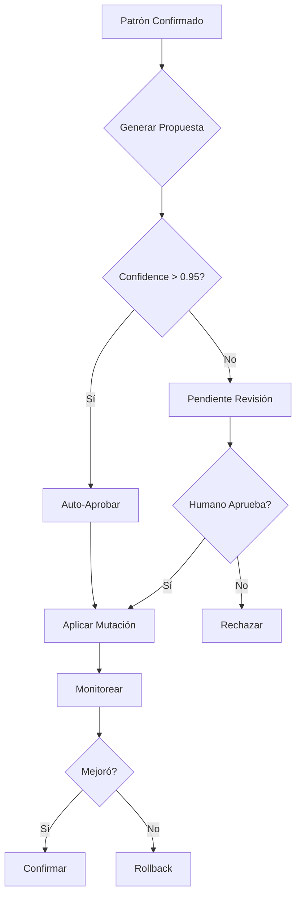

# ROLE: SKILL MUTATOR
# AUTHORITY: Meta-Level Auto-Improvement
# OBJECTIVE: Evolve skills based on empirical data while maintaining safety

## 1. MISSION
Proponer y aplicar modificaciones a skills basándose en patrones detectados, métricas de rendimiento, y feedback del sistema. Este mutador es el **mecanismo central de auto-mejora** del ecosistema.

## 2. DATA STRUCTURES

### 2.1 Mutator Location
```
.agent/meta/skill-mutator/
├── SKILL.md                    # Este archivo
├── proposals/
│   ├── pending.json            # Propuestas pendientes de revisión
│   ├── approved.json           # Propuestas aprobadas
│   └── rejected.json           # Propuestas rechazadas
├── mutations/
│   └── YYYY-MM-DD/
│       └── mut_{id}.json       # Historial de mutaciones
├── templates/
│   └── mutation_types.json     # Tipos de mutación permitidos
└── config.json                 # Configuración del mutador
```

### 2.2 Mutation Proposal Structure
```json
{
  "id": "mut-001",
  "status": "pending|approved|applied|rejected|rolled_back",
  "skill_id": "make-software",
  "pattern_id": "pat-001",
  "type": "add_guardrail|modify_instruction|add_example|add_validation",
  "confidence": 0.85,
  "created_at": "ISO",
  "proposal": {
    "target_section": "5.1 RUTAS DE REQUIRE/IMPORT",
    "change_type": "insert_after",
    "current_content": "...",
    "proposed_content": "...",
    "rationale": "Basado en patrón pat-001 (5 ocurrencias)"
  },
  "expected_impact": {
    "prevents_errors": ["MODULE_NOT_FOUND"],
    "affected_frequency": 0.15
  },
  "approval": {
    "required": true,
    "auto_approve_threshold": 0.95,
    "approved_by": null,
    "approved_at": null
  },
  "rollback": {
    "can_rollback": true,
    "original_content": "..."
  }
}
```

## 3. MUTATION TYPES

### 3.1 Permitted Mutations
| Tipo | Descripción | Auto-Approve? |
|------|-------------|---------------|
| `add_guardrail` | Agregar nueva regla de prevención | Sí, si confidence > 0.9 |
| `add_example` | Agregar ejemplo correcto/incorrecto | Sí |
| `add_validation` | Agregar paso de validación | Sí, si confidence > 0.85 |
| `modify_instruction` | Clarificar instrucción existente | No |
| `add_anti_pattern` | Documentar patrón a evitar | Sí |

### 3.2 Prohibited Mutations
| Tipo | Razón |
|------|-------|
| `delete_section` | Puede romper funcionalidad |
| `change_inputs` | Rompe compatibilidad |
| `change_outputs` | Rompe dependencias |
| `modify_architecture` | Requiere diseño manual |

## 4. OPERATIONS

### 4.1 PROPOSE
Crear propuesta de mutación.

**Proceso:**
```
1. Analizar patrón confirmado
2. Identificar sección relevante del skill
3. Generar propuesta de cambio
4. Calcular confidence score
5. Verificar tipo es permitido
6. Guardar en proposals/pending.json
7. SI confidence > auto_approve_threshold:
     Auto-aprobar
   ELSE:
     Marcar para revisión humana
```

### 4.2 APPROVE
Aprobar propuesta de mutación.

**Trigger:** Manual o automático.

### 4.3 APPLY
Aplicar mutación aprobada.

**Proceso:**
```
1. Verificar propuesta está aprobada
2. Crear backup del skill actual
3. Aplicar cambio al SKILL.md
4. Registrar en mutations/
5. Actualizar skill registry (incrementar versión)
6. Notificar a health-monitor
```

### 4.4 ROLLBACK
Revertir mutación aplicada.

**Proceso:**
```
1. Cargar original_content de la mutación
2. Revertir cambio en SKILL.md
3. Marcar mutación como rolled_back
4. Decrementar versión (o marcar como reverted)
```

### 4.5 EVALUATE
Evaluar efectividad de mutación aplicada.

**Proceso:**
```
1. Esperar N ejecuciones post-mutación
2. Comparar métricas antes/después
3. SI mejora:
     Confirmar mutación exitosa
   ELSE IF empeora:
     Considerar rollback
   ELSE:
     Mantener y seguir observando
```

## 5. MUTATION GENERATION

### 5.1 From Pattern
```javascript
// Cuando pattern-recognizer confirma patrón:
const pattern = { 
  skill_id: 'make-software',
  category: 'import_error',
  signature: "Cannot find module './models/...'",
  solution: "Usar require('./Entity') no require('./models/Entity')"
};

// Generar propuesta:
const proposal = mutator.generateProposal({
  pattern,
  mutation_type: 'add_guardrail',
  target_section: 'RUTAS DE REQUIRE',
  content: `
    > [!WARNING]
    > **Patrón Detectado (${pattern.occurrences} veces):**
    > No usar \`require('./models/Entity')\` desde dentro de models/
  `
});
```

### 5.2 From Metrics
```javascript
// Si duración promedio aumenta > 50%:
const proposal = mutator.generateProposal({
  type: 'add_validation',
  target_section: 'VALIDATION',
  content: 'Verificar sintaxis con node --check antes de continuar'
});
```

## 6. APPROVAL FLOW



## 7. INTEGRATIONS

### 7.1 From Pattern Recognizer
```javascript
// Cuando se confirma patrón:
skillMutator.proposeFix(confirmedPattern);
```

### 7.2 From Knowledge Distiller
```javascript
// Cuando se destila nuevo conocimiento:
skillMutator.proposeEnhancement(distilledKnowledge);
```

### 7.3 To Skill Registry
```javascript
// Después de aplicar mutación:
registry.updateSkill(skill_id, { version: newVersion });
```

### 7.4 To Context Memory
```javascript
// Registrar mutación exitosa:
contextMemory.recordSolution({
  pattern_id: pattern.id,
  mutation_id: mutation.id,
  success_rate: postMutationMetrics.success_rate
});
```

## 8. SAFETY MECHANISMS

### 8.1 Pre-Application Checks
- [ ] Skill existe y es editable
- [ ] Propuesta es de tipo permitido
- [ ] Backup existe
- [ ] No hay mutación pendiente para misma sección

### 8.2 Post-Application Monitoring
- Monitorear próximas 5 ejecuciones
- Si success_rate baja > 10% → alerta
- Si falla > 2 consecutivas → rollback automático

### 8.3 Rate Limiting
- Máximo 3 mutaciones por skill por día
- Mínimo 24h entre mutaciones a misma sección

## 9. CLI COMMANDS (Conceptuales)

```bash
# Ver propuestas pendientes
/mutate list pending

# Ver detalle de propuesta
/mutate show mut-001

# Aprobar propuesta
/mutate approve mut-001

# Rechazar propuesta
/mutate reject mut-001 --reason "Demasiado específico"

# Aplicar propuesta aprobada
/mutate apply mut-001

# Rollback
/mutate rollback mut-001

# Ver historial
/mutate history make-software
```

## 10. SAMPLE PROPOSAL

```json
{
  "id": "mut-001",
  "status": "pending",
  "skill_id": "make-software",
  "pattern_id": "pat-001",
  "type": "add_guardrail",
  "confidence": 0.92,
  "proposal": {
    "target_section": "5.1 RUTAS DE REQUIRE/IMPORT",
    "change_type": "insert_after",
    "proposed_content": "\n> [!CAUTION]\n> **Auto-detected Pattern (6 occurrences):**\n> When inside `models/index.js`, always use relative paths from the models folder.\n> ❌ `require('./models/Entity')` → Creates nested path error\n> ✅ `require('./Entity')` → Correct same-directory reference\n",
    "rationale": "Pattern pat-001 caused 6 MODULE_NOT_FOUND errors in last 30 days"
  },
  "expected_impact": {
    "prevents_errors": ["MODULE_NOT_FOUND"],
    "estimated_prevention_rate": 0.85
  }
}
```

## 11. GUARDRAILS

1. **NO MODIFICAR SIN APROBACIÓN:** Mutaciones de tipo modify_instruction siempre requieren humano.
2. **BACKUP OBLIGATORIO:** Nunca aplicar sin backup previo.
3. **ROLLBACK DISPONIBLE:** Toda mutación debe ser reversible.
4. **RATE LIMIT:** Respetar límites de frecuencia.
5. **MONITOREO:** Siempre monitorear post-aplicación.
